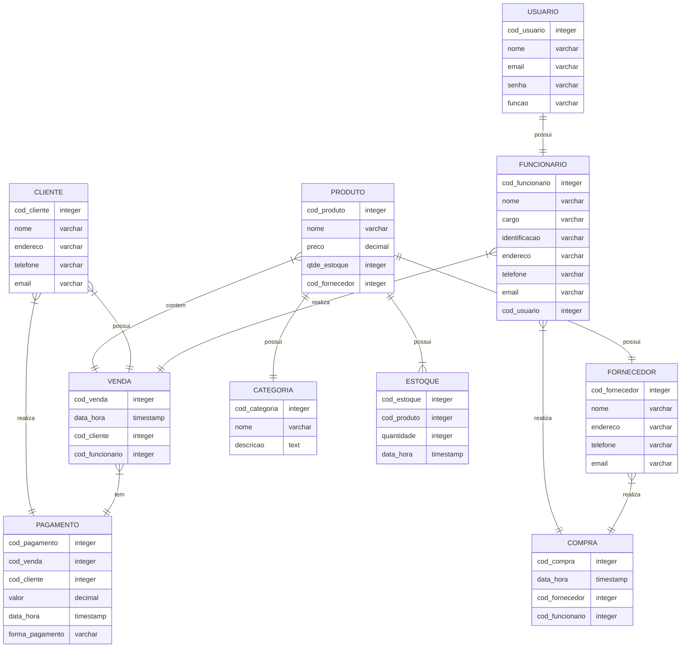

# Modelo Conceitual

```mermaid
    erDiagram
        PRODUTO ||--|| FORNECEDOR : possui
        PRODUTO }|--|| VENDA : contem
        PRODUTO ||--|| CATEGORIA : possui
        PRODUTO ||--|{ ESTOQUE : possui
        CLIENTE }|--|| VENDA : possui
        FUNCIONARIO }|--|| VENDA : realiza
        FUNCIONARIO }|--|| COMPRA : realiza
        FORNECEDOR }|--|| COMPRA : realiza
        CLIENTE }|--|| PAGAMENTO : realiza
        VENDA }|--|| PAGAMENTO : tem
        USUARIO ||--|| FUNCIONARIO : possui
        USUARIO {
            cod_usuario integer
            nome varchar
            email varchar
            senha varchar
            funcao varchar
        }
        PRODUTO {
             cod_produto integer
             nome varchar
             preco decimal
             qtde_estoque integer
             cod_fornecedor integer

        }
        CLIENTE {
            cod_cliente integer
            nome varchar
            endereco varchar
            telefone varchar
            email varchar
       }
        FORNECEDOR {
            cod_fornecedor integer
            nome varchar
            endereco varchar
            telefone varchar
            email varchar
        }   
         VENDA {
            cod_venda integer
            data_hora timestamp
            cod_cliente integer
            cod_funcionario integer
        }
         FUNCIONARIO {
            cod_funcionario integer
            nome varchar
            cargo varchar
            identificacao varchar
            endereco varchar
            telefone varchar
            email varchar
            cod_usuario integer
        }
        ESTOQUE {
            cod_estoque integer
            cod_produto integer
            quantidade integer
            data_hora timestamp
        }
        COMPRA {
            cod_compra integer
            data_hora timestamp
            cod_fornecedor integer
            cod_funcionario integer
        }
        CATEGORIA {
            cod_categoria integer
            nome varchar
            descricao text
        }
        PAGAMENTO {
            cod_pagamento integer
            cod_venda integer
            cod_cliente integer
            valor decimal
            data_hora timestamp
            forma_pagamento varchar
        } 
      
```
