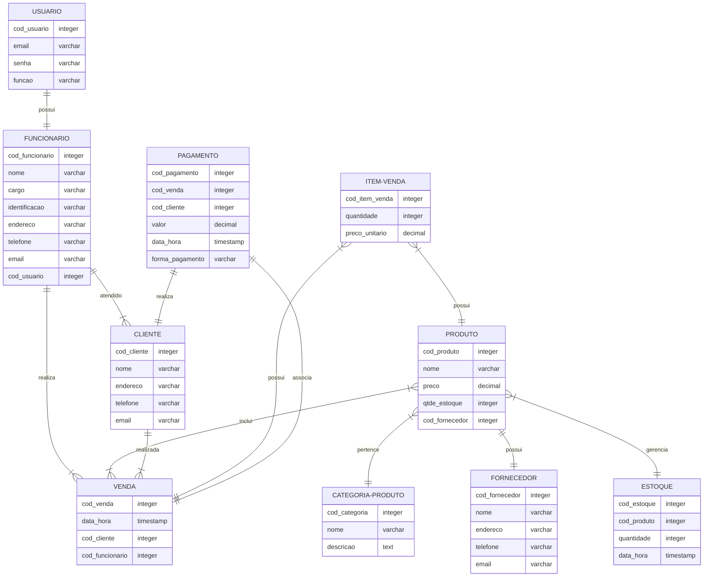

# Modelo Conceitual

```mermaid
    erDiagram
        USUARIO ||--|| FUNCIONARIO : possui
        FUNCIONARIO || --|{ CLIENTE : atendido
        FUNCIONARIO ||--|{ VENDA : realiza
        PRODUTO }|--|| CATEGORIA-PRODUTO : pertence
        PRODUTO }|--|{ VENDA : inclui
        PRODUTO ||--|| FORNECEDOR : possui
        PRODUTO }|--|| ESTOQUE : gerencia
        CLIENTE ||--|{ VENDA : realizada
        ITEM-VENDA }|--|| VENDA : possui
        ITEM-VENDA }|--|| PRODUTO : possui
        PAGAMENTO ||--|| VENDA  : associa
        PAGAMENTO ||--|| CLIENTE : realiza
        USUARIO {
            cod_usuario integer
            email varchar
            senha varchar
            funcao varchar
        }
        PRODUTO {
             cod_produto integer
             nome varchar
             preco decimal
             qtde_estoque integer
             cod_fornecedor integer

        }
        CLIENTE {
            cod_cliente integer
            nome varchar
            endereco varchar
            telefone varchar
            email varchar
       }
        FORNECEDOR {
            cod_fornecedor integer
            nome varchar
            endereco varchar
            telefone varchar
            email varchar
        }   
         VENDA {
            cod_venda integer
            data_hora timestamp
            cod_cliente integer
            cod_funcionario integer
        }
        ITEM-VENDA {
            cod_item_venda integer
            quantidade integer
            preco_unitario decimal
        }
         FUNCIONARIO {
            cod_funcionario integer
            nome varchar
            cargo varchar
            identificacao varchar
            endereco varchar
            telefone varchar
            email varchar
            cod_usuario integer
        }
        ESTOQUE {
            cod_estoque integer
            cod_produto integer
            quantidade integer
            data_hora timestamp
        }
        CATEGORIA-PRODUTO {
            cod_categoria integer
            nome varchar
            descricao text
        }
        PAGAMENTO {
            cod_pagamento integer
            cod_venda integer
            cod_cliente integer
            valor decimal
            data_hora timestamp
            forma_pagamento varchar
        } 
      
```
