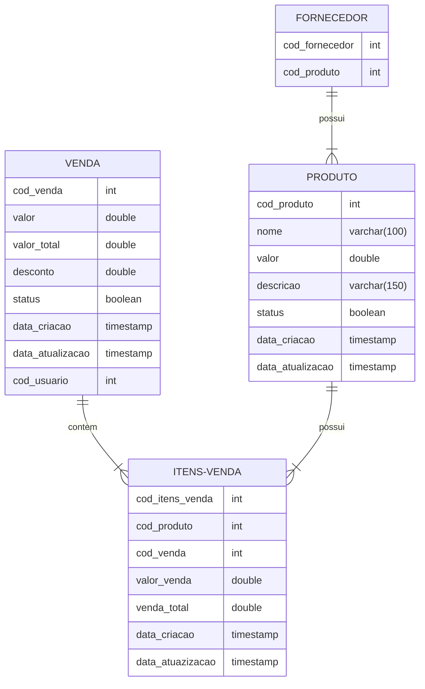

```mermaid
erDiagram
    VENDA ||--|{ ITENS-VENDA : contem
    VENDA {
        cod_venda int
        valor double
        valor_total double
        desconto double
        status boolean
        data_criacao timestamp
        data_atualizacao timestamp
        cod_usuario int
    }
    PRODUTO ||--|{ ITENS-VENDA : possui
    PRODUTO {
        cod_produto int
        nome varchar(100)
        valor double
        descricao varchar(150)
        status boolean
        data_criacao timestamp
        data_atualizacao timestamp
    }
    ITENS-VENDA {
       cod_itens_venda int
       cod_produto int
       cod_venda int
       valor_venda double
       venda_total double
       data_criacao timestamp
       data_atuazizacao timestamp
    }
   FORNECEDOR ||--|{ PRODUTO : possui
    FORNECEDOR {
    cod_fornecedor int
    cod_produto int
    }
    
```
