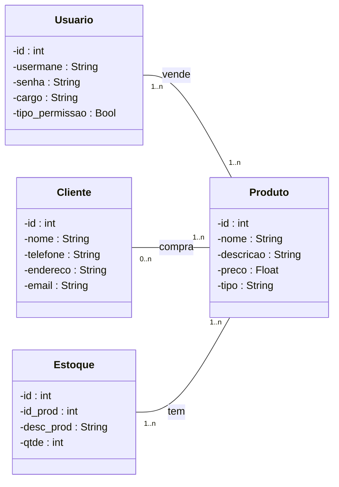

```mermaid

classDiagram
  direction RL
  class Produto {
    -id : int
    -nome : String
    -descricao : String
    -preco : Float
    -tipo : String
  }
  class Usuario{
    -id : int
    -usermane : String
    -senha : String
    -cargo : String
    -tipo_permissao : Bool
  }
  class Cliente{
    -id : int
    -nome : String
    -telefone : String
    -endereco : String
    -email : String
  }
  class Estoque{
    -id : int 
    -id_prod : int
    -desc_prod : String
    -qtde : int
  }

  Produto "1..n" -- "1..n" Usuario : vende
  Produto "1..n" -- "0..n" Cliente : compra
  Produto "1..n" -- "1..n" Estoque : tem


```