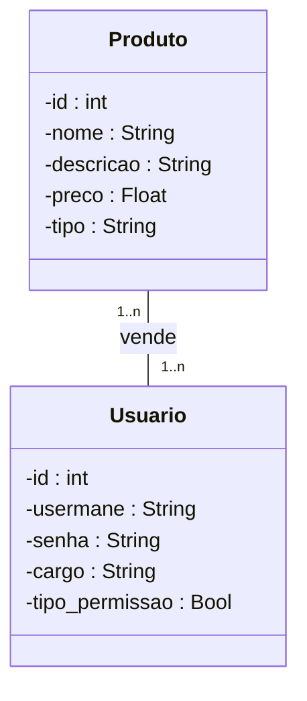

```mermaid

classDiagram
  class Produto {
    -id : int
    -nome : String
    -descricao : String
    -preco : Float
    -tipo : String
  }
  class Usuario{
    -id : int
    -usermane : String
    -senha : String
    -cargo : String
    -tipo_permissao : Bool
  }

  Produto "1..n" -- "1..n" Usuario : vende


```